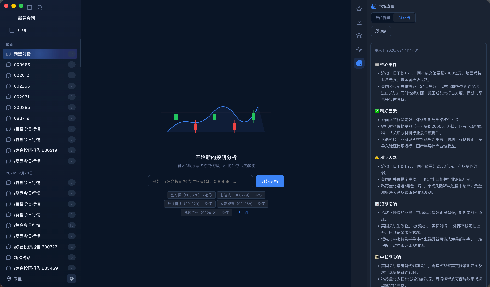
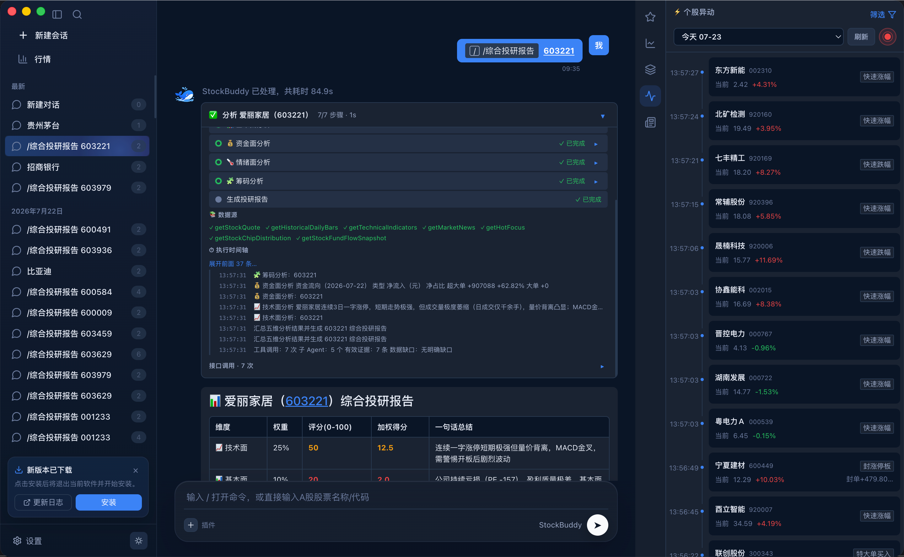
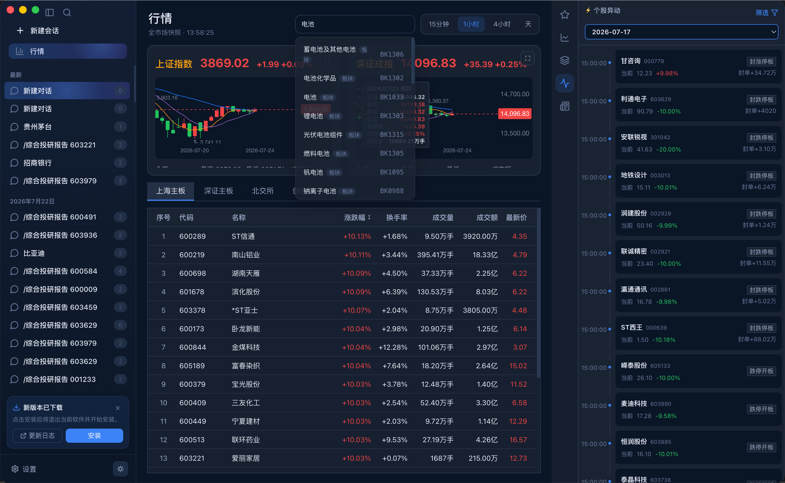
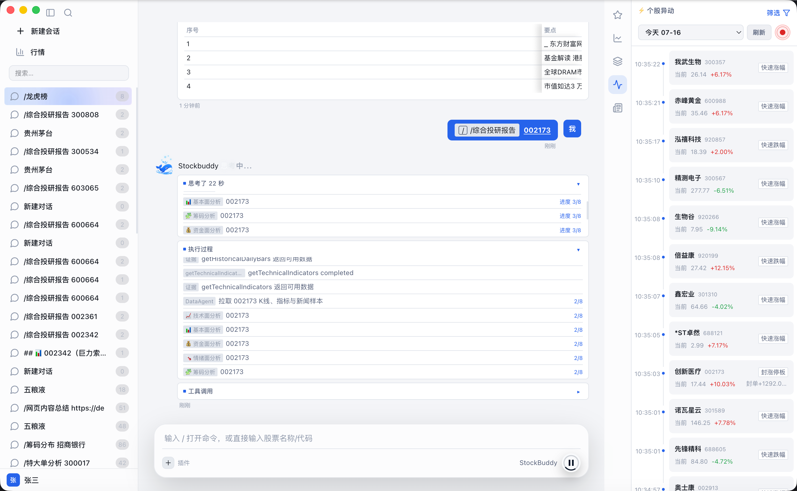
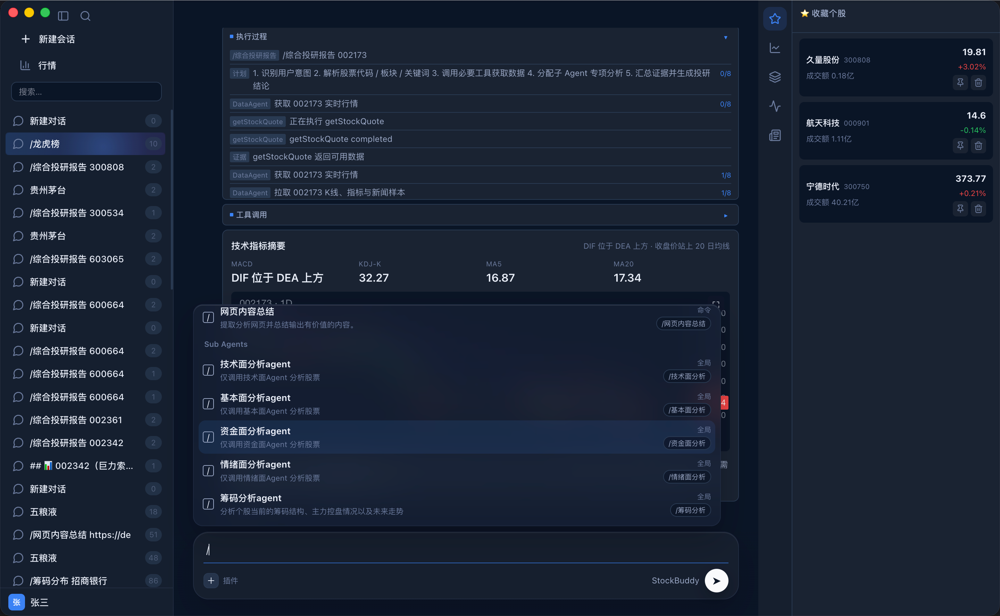
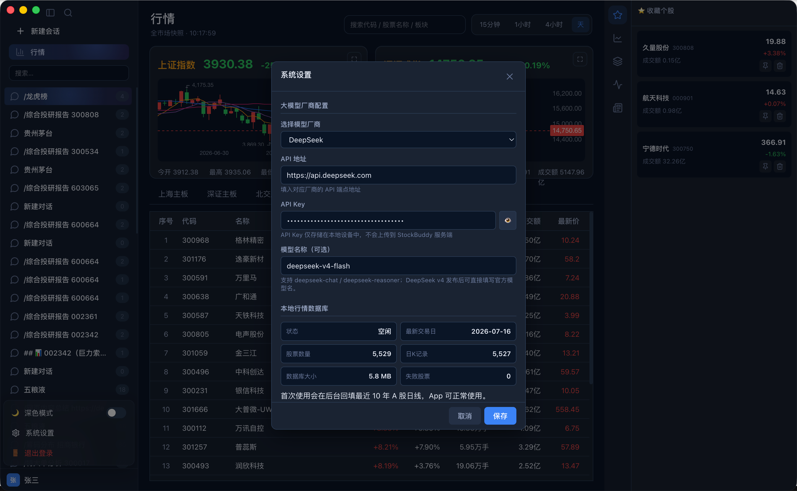
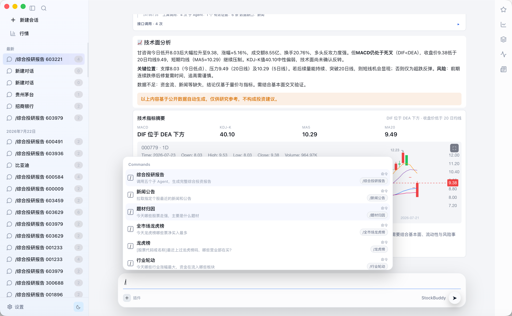

# StockBuddy

对话式 A 股投研助手，面向个人投资者与研究人员，聚合行情、K 线、板块、资金流与新闻信息，用自然语言完成股票研究、风险梳理和投研报告生成。

> StockBuddy 仅用于公开数据研究与信息辅助，不构成任何投资建议。

下载地址：[https://github.com/StockBuddy/StockBuddy/releases](https://github.com/StockBuddy/StockBuddy/releases)

## 功能特性

- 三栏桌面端 UI：会话列表、对话式投研、股票详情面板
- 对话式 A 股分析：行情查询、技术指标、板块/资金流、持仓记忆预留
- `stock-sdk` 数据接入：A 股行情、K 线、技术指标、资金流等
- 多 Agent MVP：Orchestrator / DataAgent / AnalysisAgent / ReportAgent / RiskAgent
- 系统设置弹窗：大模型厂商、API 地址、API Key、模型名、交易风格、风险偏好、持仓周期
- 常用模型厂商预设：
  - DeepSeek（含 deepseek-chat / deepseek-reasoner / 自定义 DeepSeek v4 模型名）
  - OpenAI
  - 通义千问 Qwen
  - MiniMax
  - 智谱 GLM
  - Kimi
  - OpenAI Compatible
  - 自定义 API
- 深浅色主题切换
- PWA 支持：service worker + 离线支持
- Electron 打包支持：macOS DMG / Windows

## 产品定位

StockBuddy 希望把传统投研终端里的信息检索、行情观察、指标分析和报告整理，压缩到一个更自然的对话入口中。用户可以像和研究助理沟通一样提出问题，系统会围绕股票、板块、行情和风险给出结构化分析。

适合用于：

- 快速了解一只股票的行情表现、技术形态与核心变化
- 整理公开信息、新闻事件、公告与板块联动
- 生成更易阅读的投研摘要、风险提示和综合结论
- 记录个人偏好、交易风格与本地会话上下文

## 核心能力

### 对话式投研

通过自然语言提问，完成股票查询、行情解读、技术分析、风险提示和报告生成，降低传统行情软件的信息检索成本。

### 股票详情与行情面板

在对话过程中同步展示股票详情、价格表现、图表与相关市场信息，方便边问边看。

### 多 Agent 分析流程

围绕数据采集、行情分析、报告生成和风险识别进行分工，让输出更接近“研究助理”的工作流。

### 本地配置与个性化偏好

支持配置常用大模型服务、API Key、模型名称、交易风格、风险偏好和持仓周期。配置保存在本地，便于个人化使用。

### 专业化报告展示

报告内容采用结构化 Markdown 展示，突出核心事件、利好因素、利空因素、短期影响、中长期影响、风险提示和综合结论。

### 深浅色主题与桌面体验

提供适合长时间阅读的桌面端界面，支持深浅色主题切换，兼顾行情浏览、对话分析和报告阅读。

## ChangeLog 更新日志

[https://ncnidfotktyq.feishu.cn/wiki/XX5RwTiQzi3HGwkpA0RcwF4UnLd](https://ncnidfotktyq.feishu.cn/wiki/XX5RwTiQzi3HGwkpA0RcwF4UnLd)
