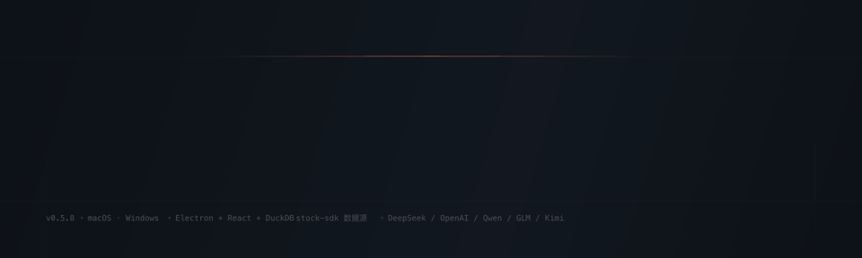
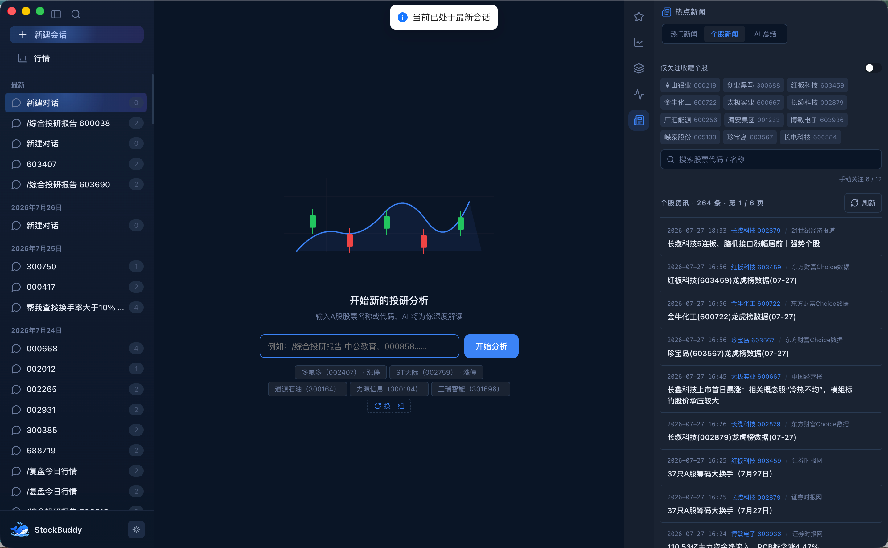
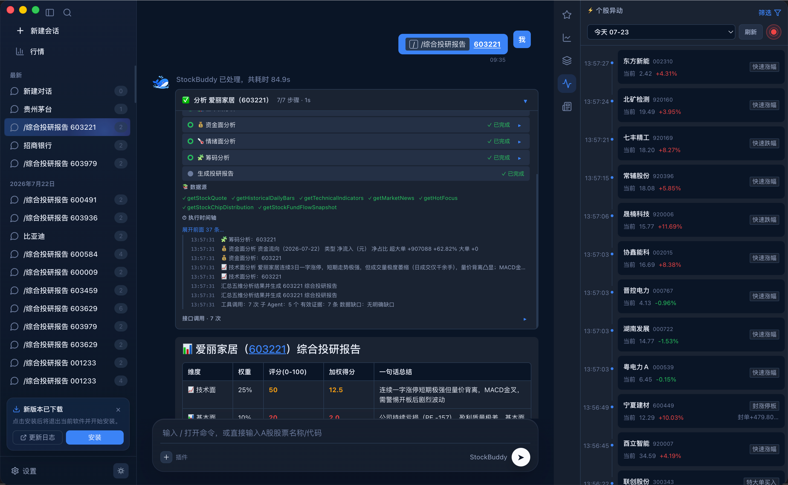
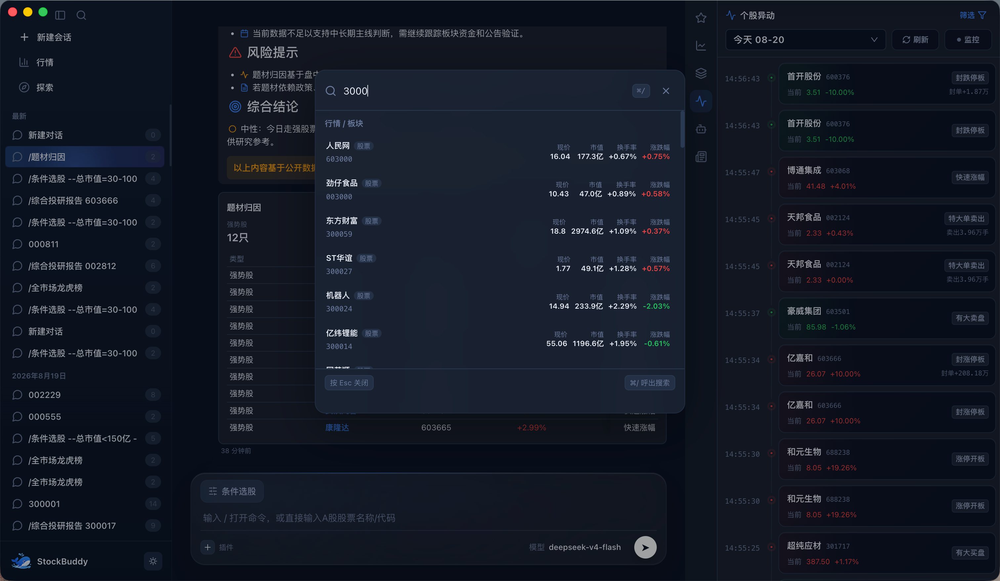
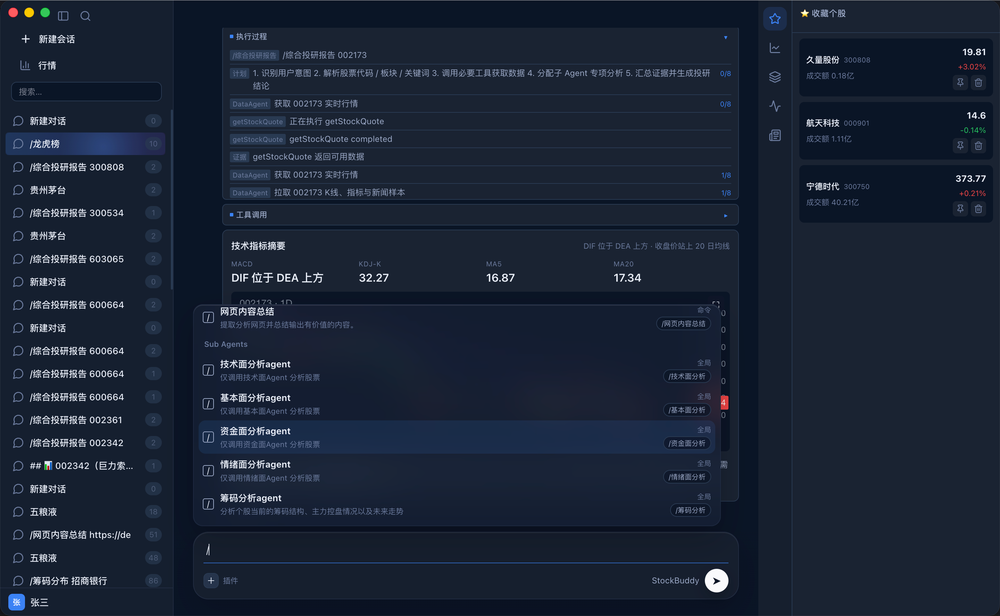
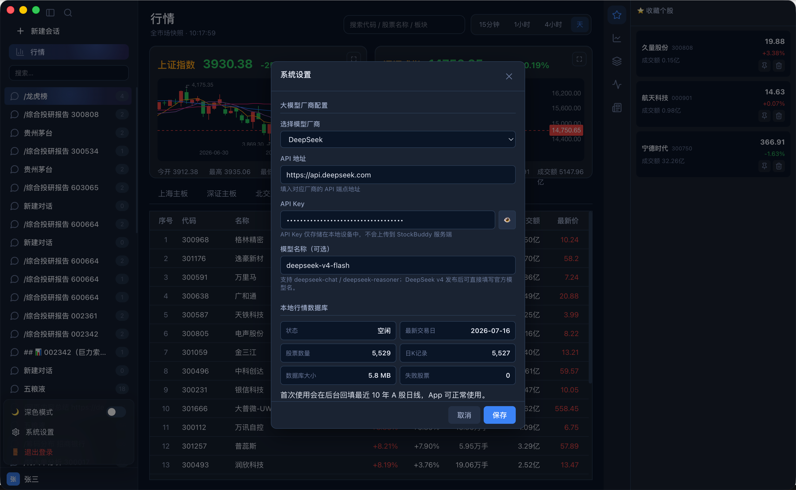
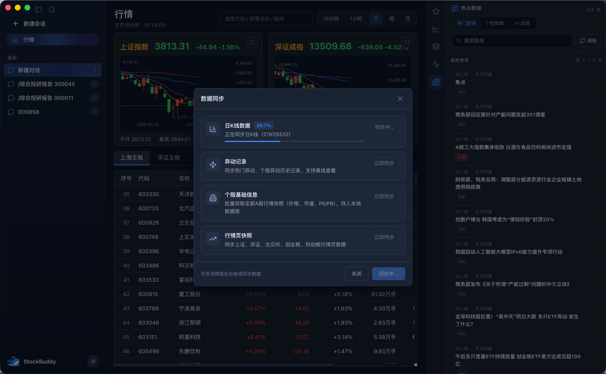
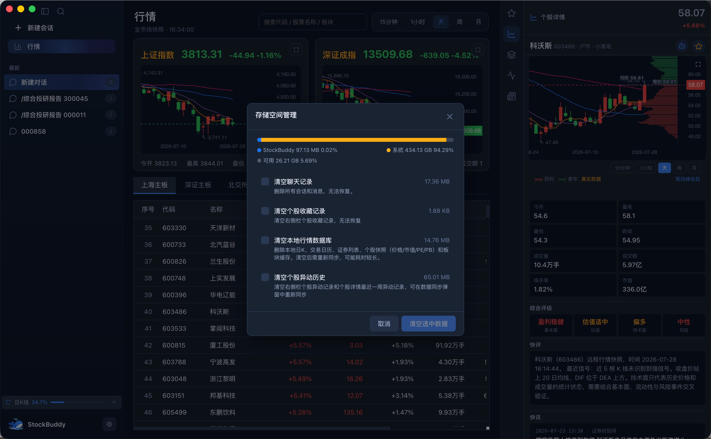
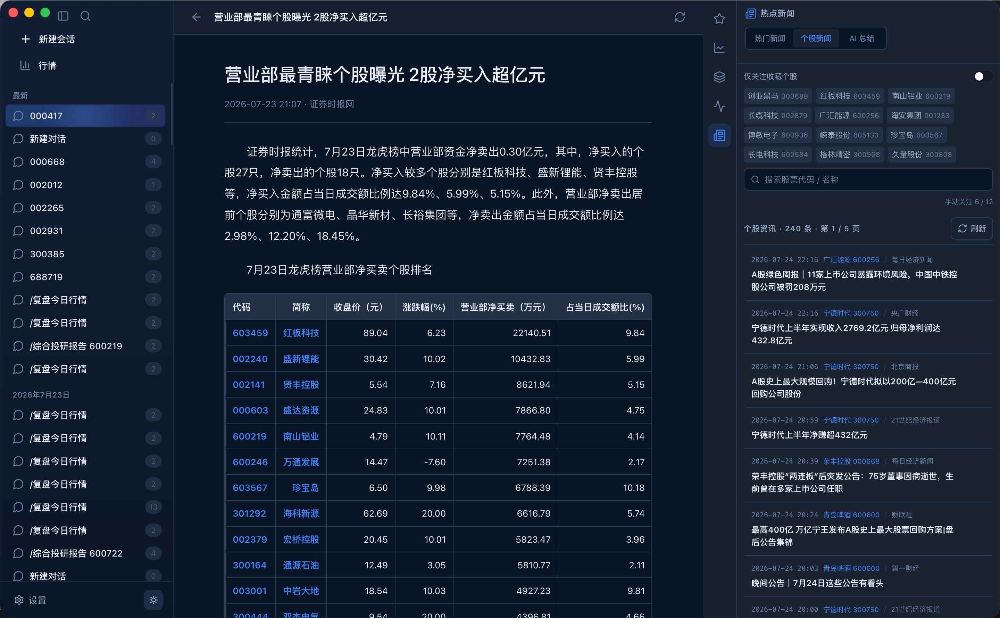

<p align="center">
  <picture>
    <source media="(prefers-color-scheme: dark)" srcset="public/assets/readme/hero.gif">
    
  </picture>
</p>

> StockBuddy 仅用于公开数据研究与信息辅助，不构成任何投资建议。

## 快速开始

[下载最新版本](https://github.com/hawx1993/stcok-buddy/releases) → 安装 → 配置 API Key → 输入股票代码或问题开始对话。

```bash
# 开发环境
pnpm install
pnpm dev
```

## 产品展示



### 对话式投研

用自然语言提问，系统自动采集行情、K 线、新闻和公告，生成结构化投研报告。



### 行情页与个股详情

实时行情面板覆盖上证主板、深证主板、北交所、创业板、科创板，支持排序、筛选和个股联动。


### 多 Agent 协作分析

Orchestrator 调度 DataAgent / AnalysisAgent / ReportAgent / RiskAgent 分工协作，从数据采集到报告生成流水线化处理。

<p align="center">
  
  
</p>

### 离线数据同步

日K线、异动记录、个股快照同步到本地 DuckDB 数据库，断网也能查看历史行情。





### 存储空间管理



### 个股新闻与 AI 摘要

支持个股新闻推送和多渠道市场热点，AI 自动总结当日要闻。



## 核心能力

| 能力       | 说明                                                         |
| ---------- | ------------------------------------------------------------ |
| 对话式投研 | 自然语言查询股票、板块、行情，生成 Bloomberg 风格结构化报告  |
| 实时行情   | 全 A 股五档盘口、分时 K 线，五大板块行情页，支持排序与筛选   |
| 技术分析   | MA / MACD / KDJ / RSI / BOLL / SAR 等 14 类技术指标          |
| 资金流向   | 主力净流入、板块排名、龙虎榜、个股资金流历史                 |
| 离线缓存   | DuckDB 本地存储日 K、异动记录、个股快照，断网可用            |
| 多模型     | DeepSeek / OpenAI / Qwen / GLM / Kimi / MiniMax / 自定义 API |
| 多 Agent   | Orchestrator → Data → Analysis → Report → Risk 流水线        |
| 桌面体验   | 深浅色主题、PWA 离线支持、macOS DMG / Windows 安装包         |

## 技术架构

```text
┌─ Renderer (React + Vite) ─────────────────────────────┐
│  会话面板  │  ChatView (AI 对话)  │  行情页 / 个股详情   │
└────────────────────── IPC ─────────────────────────────┘
┌─ Main (Electron) ──────────────────────────────────────┐
│  Agent Orchestrator  │  stock-sdk  │  DuckDB / SQLite  │
└────────────────────────────────────────────────────────┘
```

- **Renderer**: React 18 + Zustand + Vite + Ant Design + Recharts
- **Main**: Electron + stock-sdk + DuckDB (node-api) + better-sqlite3
- **AI**: 多 Agent 编排器，支持流式 SSE 响应
- **数据**: stock-sdk → Provider → DuckDB/SQLite → Memory Cache
- **打包**: electron-builder, macOS DMG + Windows NSIS

## 更新日志

[https://ncnidfotktyq.feishu.cn/wiki/XX5RwTiQzi3HGwkpA0RcwF4UnLd](https://ncnidfotktyq.feishu.cn/wiki/XX5RwTiQzi3HGwkpA0RcwF4UnLd)
