<p align="center">
  <video controls playsinline poster="public/assets/readme/hero.gif" width="100%" aria-label="StockBuddy 产品介绍视频">
    <source src="https://github.com/user-attachments/assets/ef5212b8-e23b-452a-bd92-105b8f2d2fa8" type="video/mp4">
    您的浏览器不支持内嵌视频播放。
  </video>
</p>


https://github.com/user-attachments/assets/ef5212b8-e23b-452a-bd92-105b8f2d2fa8


> StockBuddy 仅用于公开数据研究与信息辅助，不构成任何投资建议。

## 快速开始

[下载最新版本](https://github.com/hawx1993/stcok-buddy/releases) → 安装 → 配置 API Key → 输入股票代码或问题开始对话。

```bash
# 开发环境
pnpm install
pnpm dev
```

## 产品展示

### 对话式投研

用自然语言提问，系统自动采集行情、K 线、新闻和公告，生成结构化投研报告。

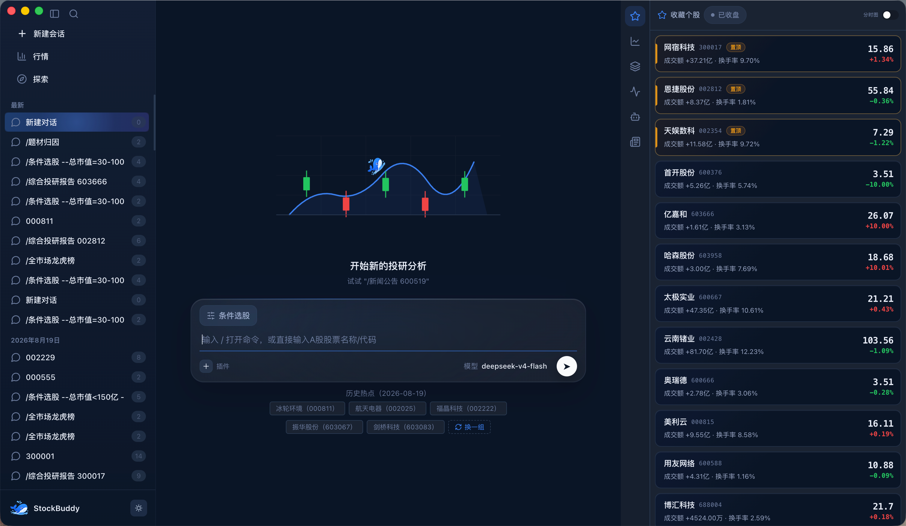

### Slash Command 与多 Agent 协作

通过 Slash Command 快速发起综合投研、新闻公告、题材归因和市场复盘；Orchestrator 调度 DataAgent / AnalysisAgent / ReportAgent / RiskAgent 分工协作，从数据采集到报告生成流水线化处理。

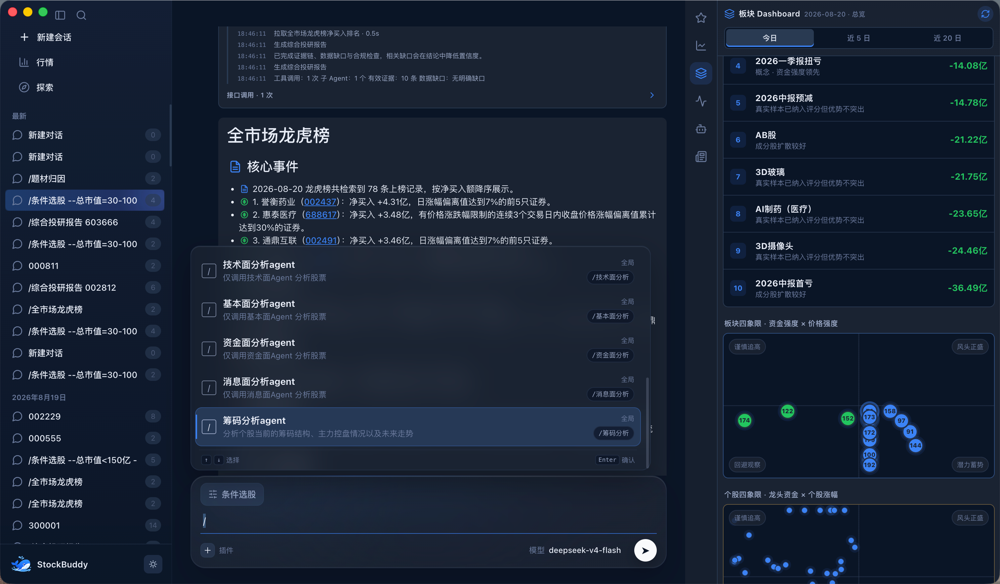

### 条件选股

组合预设与自然语言条件协同工作，支持按市值、换手率、成交额、筹码和板块等条件筛选股票。

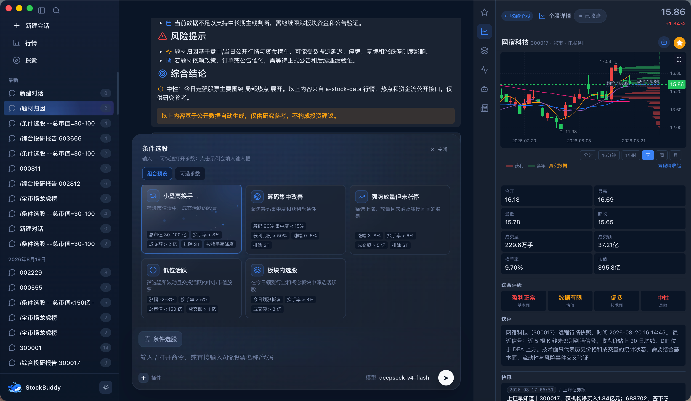

### 行情页与个股详情

实时行情面板覆盖上证主板、深证主板、北交所、创业板、科创板，支持排序、筛选和个股联动。

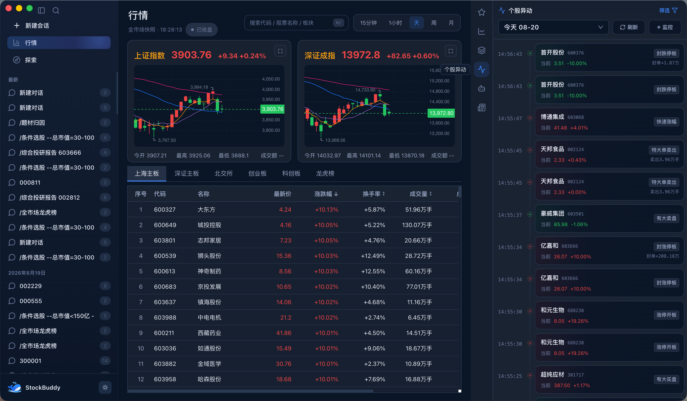

右侧栏可查看个股异动、保留最近一周的数据到本地，可查看k线图、筹码分布，平均成本等
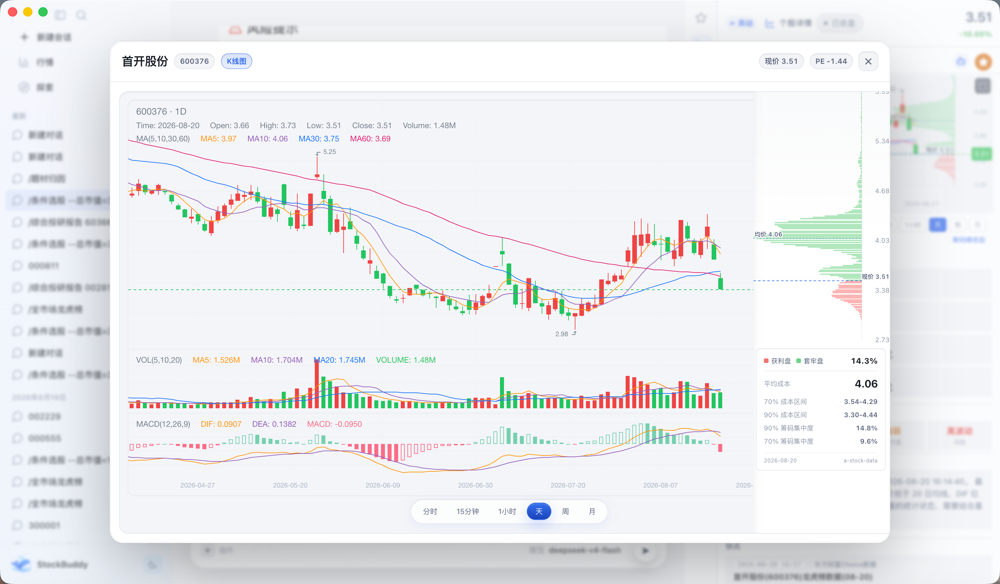

### 市场 Dashboard 与龙虎榜

围绕市场总览、板块强弱、资金流向和龙虎榜，快速定位当日热点与异动机会。

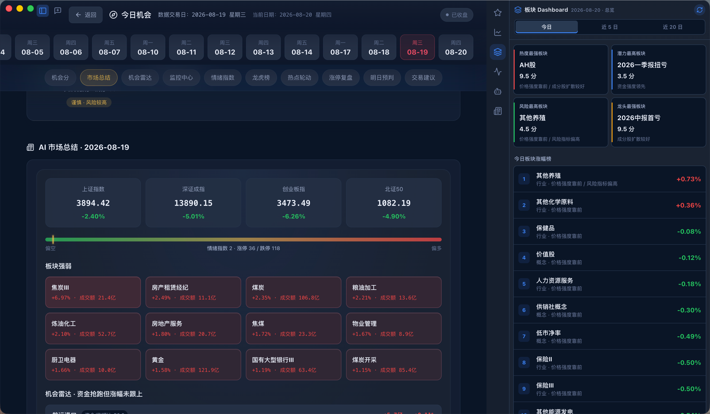

可在市场页面查看龙虎榜
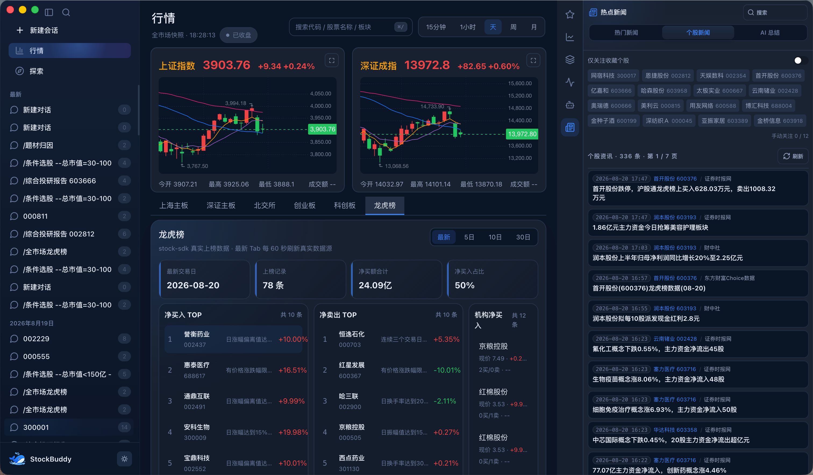

### AI 监控

实时聚合大单异动、筹码变化和技术信号，辅助跟踪重点股票的盘中变化。

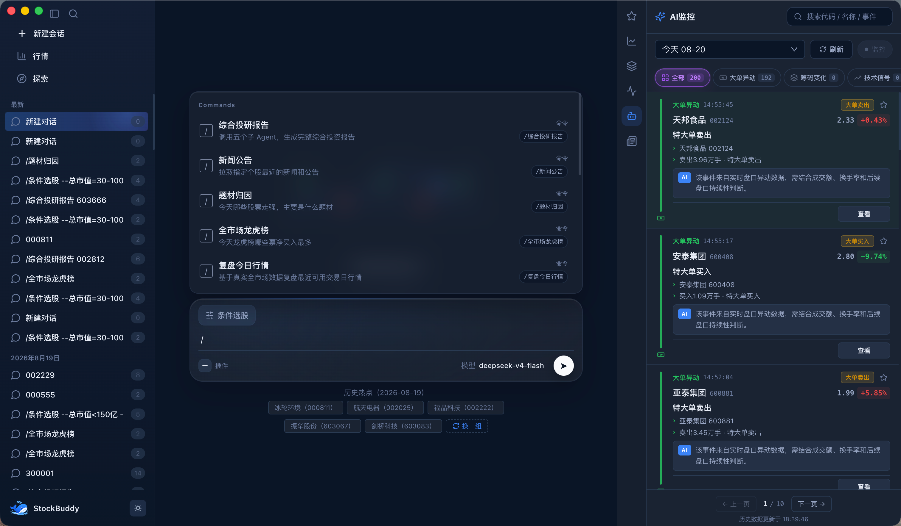

### 个股新闻与 AI 摘要

支持个股新闻推送、多渠道市场热点与 AI 摘要，也可按关键词快速检索新闻。

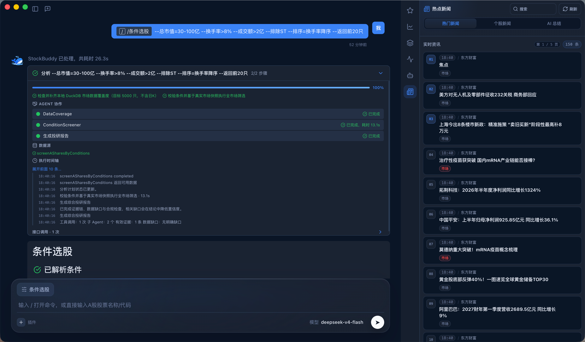

> 新闻搜索

支持全局的新闻搜索弹窗功能
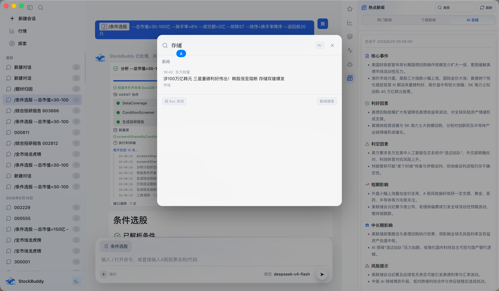

### 本地数据与系统管理

日 K 线、异动记录和个股快照可同步到本地 DuckDB 数据库；内置存储清理、更新与系统配置入口。

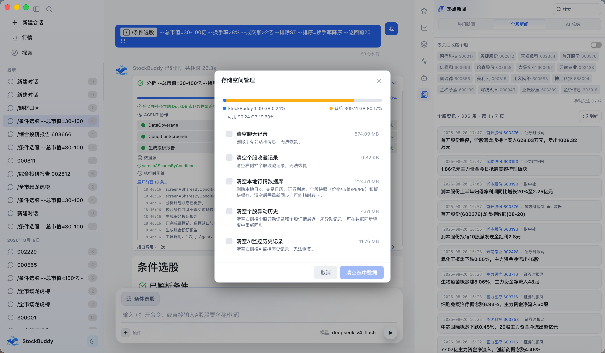

> 自动更新

支持自动更新app，点击左下角即可更新软件版本到最新版本 还可以到系统设置 手动检查更新
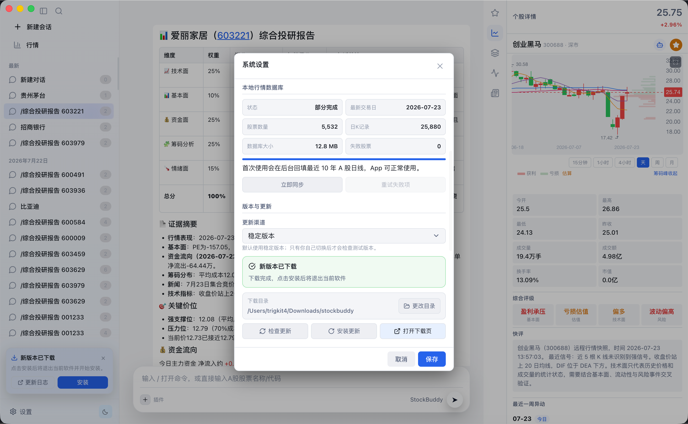

## 核心能力

| 能力       | 说明                                                               |
| ---------- | ------------------------------------------------------------------ |
| 对话式投研 | 自然语言查询股票、板块、行情，生成 Bloomberg 风格结构化报告        |
| 实时行情   | 全 A 股五档盘口、分时 K 线，五大板块行情页，支持排序与筛选         |
| 技术分析   | MA / MACD / KDJ / RSI / BOLL / SAR 等 14 类技术指标                |
| 资金流向   | 主力净流入、板块排名、龙虎榜、个股资金流历史                       |
| 离线缓存   | DuckDB 本地存储日 K、异动记录、个股快照，断网可用                  |
| 多模型     | DeepSeek / OpenAI / Qwen / GLM / Kimi / MiniMax / 自定义 API       |
| 多 Agent   | Orchestrator → Data → Analysis → Report → Risk 流水线              |
| 桌面体验   | 深浅色主题、桌面消息通知、PWA 离线支持、macOS DMG / Windows 安装包 |

## 技术架构

```text
┌─ Renderer (React + Vite) ─────────────────────────────┐
│  会话面板   │  ChatView (AI 对话)  │  行情页 / 个股详情   │
└────────────────────── IPC ────────────────────────────┘
┌───────────── Main (Electron) ──────────────────────────┐
│  Agent Orchestrator  │  stock-sdk  │  DuckDB / SQLite  │
└────────────────────────────────────────────────────────┘
```

- **Renderer**: React 18 + Zustand + Vite + Ant Design + Recharts
- **Main**: Electron + stock-sdk + DuckDB (node-api) + better-sqlite3
- **AI**: 多 Agent 编排器，支持流式 SSE 响应
- **数据**: stock-sdk → Provider → DuckDB/SQLite → Memory Cache
- **打包**: electron-builder, macOS DMG + Windows NSIS

## 更新日志

[https://ncnidfotktyq.feishu.cn/wiki/XX5RwTiQzi3HGwkpA0RcwF4UnLd](https://ncnidfotktyq.feishu.cn/wiki/XX5RwTiQzi3HGwkpA0RcwF4UnLd)
